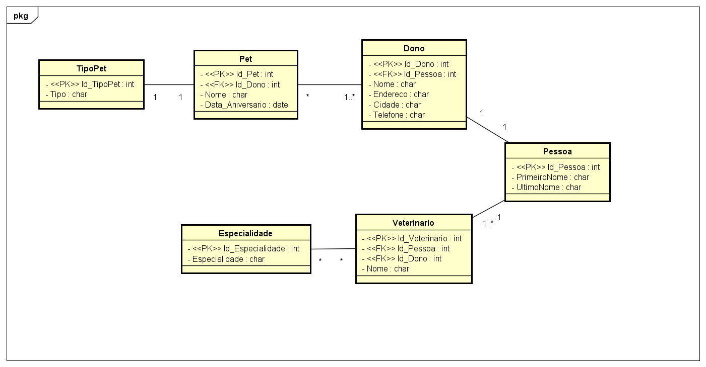

<!-- omit in toc -->
# Exercício 3

- [Enunciado](#enunciado)
- [Respostas](#respostas)
  - [a)](#a)
  - [b)](#b)
  - [c)](#c)
  - [d)](#d)

# Enunciado

Spring PetClinic é um projeto que nos últimos anos se tornou um arquétipo para a implementação de sistemas baseados em tecnologias web e apps.
A primeira versão do projeto foi utilizada como um tutorial/demonstração do framework Spring para Java EE.
A seguir, múltiplos autores desenvolveram projetos portando o sistema para múltiplas tecnologias.
Os seguintes endereços direcionam para os repositórios de código:

- https://github.com/spring-projects/spring-petclinic
- https://github.com/spring-petclinic

a) Acesse os respectivos repositórios e escolha uma versão do sistema PetClinic (o fator de escolha pode ser a tecnologia específica de implementação ou área pessoa de interesse).
Realize um fork do projeto em seu próprio repositório ou um clone local.

b) Escolha um determinado módulo ou parte do sistema e procure construir um diagrama da UML o mais representativo possível (completo).
Você poderá utilizar qualquer ferramenta de engenharia reversa que achar adequada, mas mantenha em mente que o propósito do modelo a ser construído é facilitar o entendimento e discussão sobre o domínio do problema e que, muitas vezes, será necessário acrescentar ou mudar os elementos de modelagem a fim de construir um modelo consistente.
Utilize a sintaxe e semântica conforme a linguagem UML versão 2.5.1.

c) Como referência, seu objetivo é elaborar um diagrama similar a um dos diagramas desenvolvidos por Wöhlke: https://thomas-woehlke.blogspot.com/2014/02/java-ee-7-petclinic.html, conforme visto em aula anteriormente.

d) Entregue o arquivo com o modelo desenvolvido na sala de entrega indicada no Moodle.

# Respostas

## a)

Escolhido o repositóio [Sprint Petclinic](https://github.com/spring-projects/spring-petclinic), feito o fork para [este repositório](https://github.com/ralmeidabem/spring-petclinic) e adicionado como submúdlo [aqui](https://github.com/ralmeidabem/ESOM-2020-2) na pasta `exercicio_03/`.

## b)

Diagrama UML:

## c)

Ok.

## d)

Entrega realizada no Moodle. Arquivo hospedado em um [repositório no GitHub](https://github.com/ralmeidabem/ESOM-2020-2 "Repositório ESOM 2020").
