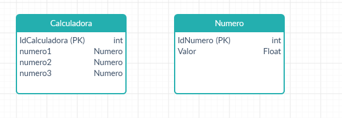

<!-- omit in toc -->
# Exercício 4

Integrantes da dupla: Pedro Chem e Rafael Almeida.

- [Enunciado](#enunciado)
- [Respostas](#respostas)
  - [a)](#a)
  - [b)](#b)
    - [Casos de uso](#casos-de-uso)
  - [c)](#c)
  - [d)](#d)
  - [e)](#e)

# Enunciado

Considere a especificação de um enunciado do URI Online Judge.
O enunciado pode ser modelado na UML com um diagrama de classes e um diagrama de casos de uso, conforme atividade anterior realizada:

a) Quais seriam os diagramas da UML que permitiriam representar os exemplos de entrada e saída que acompanham a especificação?

b) Escolha um dos diagramas e represente todo os exemplos do enunciado URI 1036:
https://www.urionlinejudge.com.br/judge/en/problems/view/1036.

c) Qual a diferença entre o diagrama da UML que representa os exemplos e os demais diagramas?

d) Como referência, localize exemplos de diagramas da UML e observe em quais exemplos é possível representar dados de entrada e saída do sistema.

e) Entreguem o arquivo com o modelo desenvolvido na sala de entrega indicada no Moodle.
Identifiquem a dupla com uma nota no diagrama.

# Respostas

## a)

Os diagramas UML que permitem representar exemplosdeenre saída que acompanham especicação são: Diagrama de Casos de Uso e Diagramade Atividades.

## b)

Exemplos:

|    Input Samples     |          Output Samples           |
| :------------------: | :-------------------------------: |
| `10.0` `20.1` `5.1`  | R1 = -0.29788   R2 = -1.71212  |
|  `0.0` `20.0` `5.0`  |        Impossivel calcular        |
| `10.3` `203.0` `5.0` | R1 = -0.02466   R2 = -19.68408 |
|  `10.0` `3.0` `5.0`  |        Impossivel calcular        |

[Fonte](https://www.urionlinejudge.com.br/judge/en/problems/view/1036).

### Casos de uso

## c)

Nesse diagrama há entradas e saídas com valores explícitos, enquanto nos demais diagramas estes valores são tratados como funções caixa-preta, ou black box.

## d)

[Fonte](https://www.uml-diagrams.org/activity-diagrams-reference.html).

## e)

Diagrama de classes:

Entrega realizada via Moodle. Arquivos hospedados [neste repositório](https://github.com/ralmeidabem/ESOM-2020-2 "Repositório ESOM 2020").
