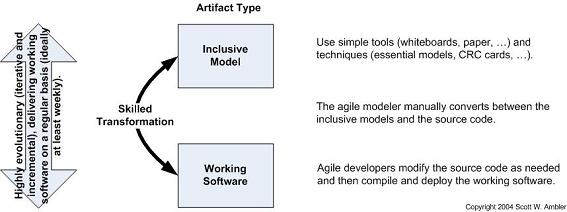
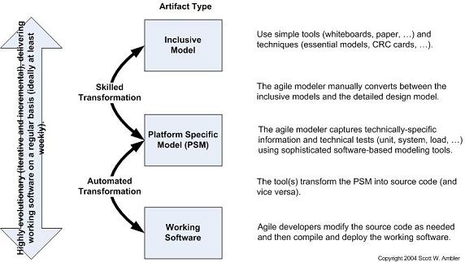
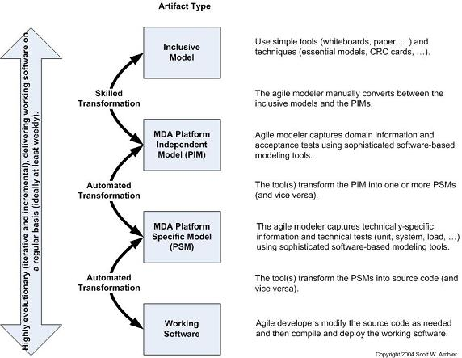

<!-- omit in toc -->
# Exercício 5

Integrantes da dupla: Pedro Chem e Rafael Almeida.

- [Enunciado](#enunciado)
- [Respostas](#respostas)
  - [a)](#a)
  - [b)](#b)
    - [AMDD Manual](#amdd-manual)
    - [Agile CASE](#agile-case)
    - [Agile MDA](#agile-mda)
  - [c)](#c)

# Enunciado

Considere o texto de Ambler (2004) visto em aula:

a) Selecione uma técnica de anotação, eg. mapas mentais, mapas conceituais ou uma das técnicas indicadas nesta referência: https://medium.goodnotes.com/the-best-notetaking-methods-for-college-students-451f412e264e.

b) Elabore um resumo do artigo de Ambler em uma página A4. O resumo pode ser realizado a mão ou com um programa de computador. 

c) Realize a entrega na sala indicada no Moodle.

# Respostas

## a)

Técnica escolhida: the outline method.

## b)

Resenha sobre Agile Model Driven Development (AMDD).

### AMDD Manual

- Simples
- Rápido
  - Muitas vezes não são nem utilizadas ferramentas de diagramação
  - Pode-se utilizar quadros brancos e cartões
- Modelo de preferência da metodologia Extreme Programming (XP)
- Em torno de 70 a 80% dos times de desenvolvimento utilizam essa estratégia

### Agile CASE

- Modelos inclusivos
  - Utilizados para alinhar requisitos com os clientes
- Ferramentas de design sofisticadas são normalmente utilizadas
- A integração entre ferramentas pode não ser muito boa
- Forte acoplamento entre modelo e código
  - Ferramentas devem suportar atualizações (se atualizar o modelo, atualiza-se o código e vice-versa)
- Método de AMDD que pode ser implementado por quaisquer equipes
  - Comum em times da metodologia Feature Driver Development (FDD)
- Menos de 20% dos times utilizam essa metodologia

### Agile MDA

- Model Driver Architecture
  - Dito o melhor uso de UML
- São utilizadas ferramentas sofisticadas
  - O software é gerado a partir do modelo
- Como no modelo CASE, modelos inclusivos são utilizados para alinhar requisitos com os clientes
- Os modelos devem ser traduzidos para PIM
- Aproximadamente 5% de todos os times de desenvolvimento utilizam essa metodologia

## c)

Entrega realizada no Moodle. Arquivo hospedado em um [repositório no GitHub](https://github.com/ralmeidabem/ESOM-2020-2 "Repositório ESOM 2020").